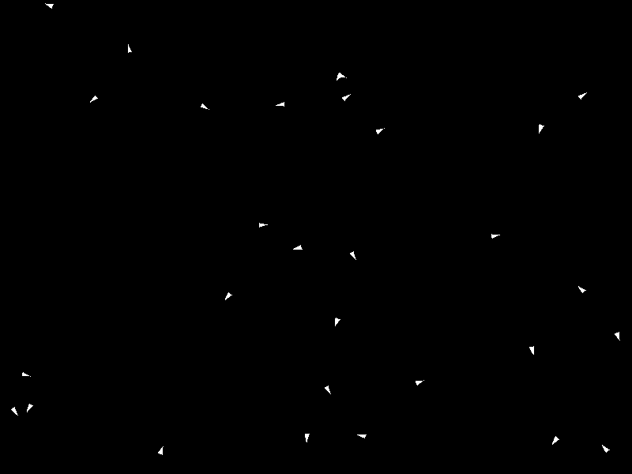

# Flocking Simulation

This project simulates flocking behavior in 2D space using `pygame` and `numpy`. The animation is saved as a GIF to demonstrate the behavior of birds following simple rules of alignment, cohesion, and separation.
Big thanks to chatgpt lol.

## Installation

1. Clone this repository.
2. Create and activate a virtual environment.
3. Install the required dependencies:
   ```bash
   pip install -r requirements.txt

